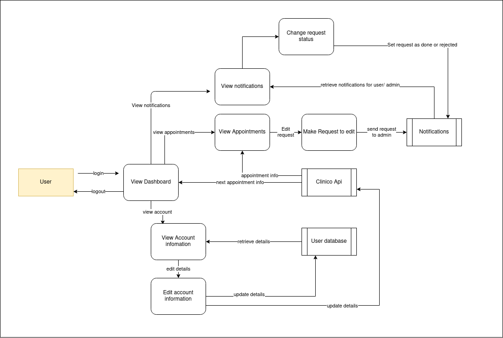
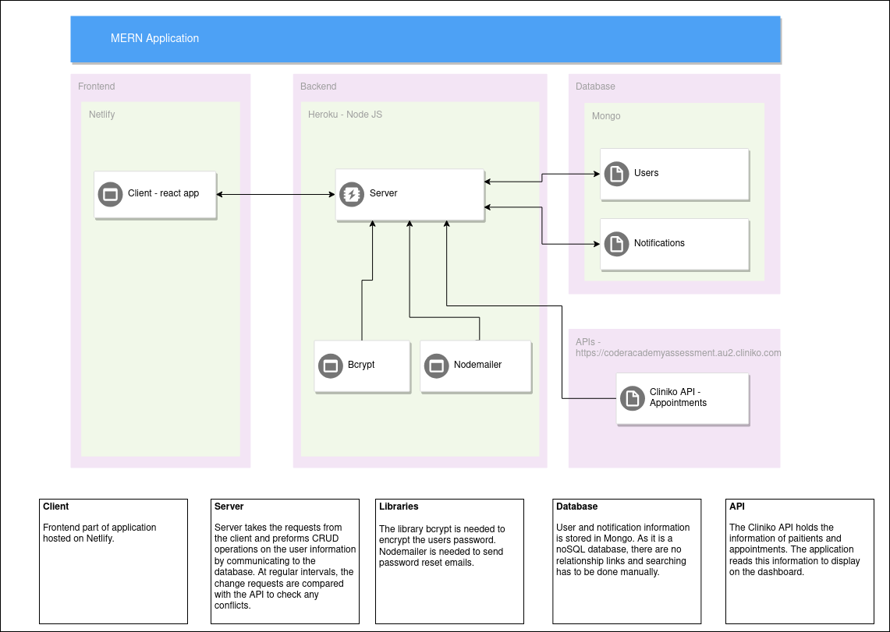

## Purpose

The aim for the MERN assessment is to create a Client Portal App for Clients of a local Allied Health Company. The MVP for the portal is that clients will be able to see their upcoming appointments, submit ticket requests to administration to change their appointments, view and edit their personal details. for additional requirements, there could be forum where users can create threads and comments.

## Functionality / features

The application would need to use a system of authentication by using a login system. The features of Login, Signup, Signout and Change Password have to be implemented. The packages used would be passport and bcrypt. There is also need of authorization to be implemented to distinguish between users (clients) and admin.

Once the users are signed in, they can read and update the personal information. The data for this would be stored on mongo and have functions for CRUD operations. If information already exists in the database, the user entry is set with the initial value. When the user updates their information it both updates the mongo database and Cliniko.

The user is able to read their appointment information on the dashboard and the view all appointments page. The information will be available through the Cliniko API where it can be read. In the appointment page, they can create change/remove requests for their appointments. 

Admin can receive notifications of change requests and contact the user with the information displayed.

With the forum section of the app, there would be CRUD capabilities for users and admin to make threads and comments.
Admin ability to pin a forum post, turn off posting on a thread, delete all users threads and posts, block a user from the forum.
    
## Target audience

The target audience for the app is the clients that have appointments and the admin of the website. The needs of the client is to view and update their details, view their appointments and submit change requests. The needs of the admin is being able to manage bookings of the client.

## Tech stack

* Mongo
* Express
* React
* Node
    
## Dataflow diagram

## Application Architecture diagram

## User Stories

1. The Client Portal

    When the client engages with the service they must book more than one appointment. This system will allow the clients to view their upcoming appointments. The user clicks on the 'signup' button on the client portal, using the same email address they used for their initial consultation with the company. Once they sign up they can then login to view their appointments at any time. 

    Users will be able to change their password in case they forget, or in case of a security breach. To change a password, the client must simply click 'forgot password' on the login page, enter their email, and an email with password reset capabilities will be sent to their email address. 

2. Client changing an Appointment

    An additional feature of the portal is submitting a request to reschedule or cancel an appointment. This request can be made by clicking the 'booked appointments' tab and then the 'Request to Edit/cancel' button alongside the appointment that the client would like to change. The client will then be asked to confirm this decision. Once clicked, the request is sent to the administration team who will call the client back in order change the time of/cancel the appointment. By clicking on the notifications tab, clients will be able to see pending and completed requests for changes to their appointment(s). Requests are updated when the administration team changes the status from 'pending' to 'completed' via the admin login of the portal.
    
3. Client Information

    Once engaged in with the company, if a client changes address, phone number(s), or would like to change their emergency contact information, they can do so through the portal, which will automatically update the company's client file.

4. Admin Portal

    Once logged in using their company email address, admin can see all pending requests from customers and all completed requests from the last 30 days in a table. Completed requests older than 30 days are automatically archived. The table displays client name, phone number, email, the appointment time, date, city and whether the request is pending or completed. Admin is able to sort the table via whether a request is pending or completed, the city of the appointment, date of the appointment, appointment type, and name in alphabetical order. Once a client has been contacted, admin can change the appointment from 'pending' to 'completed'. If an appointment is changed via the business software, the request is automatically changed to completed. This will ensure that there is no 'double handling' of requests, if made via more than one avenue e.g. request made by phone and online. 

## Wireframes

## Trello board

